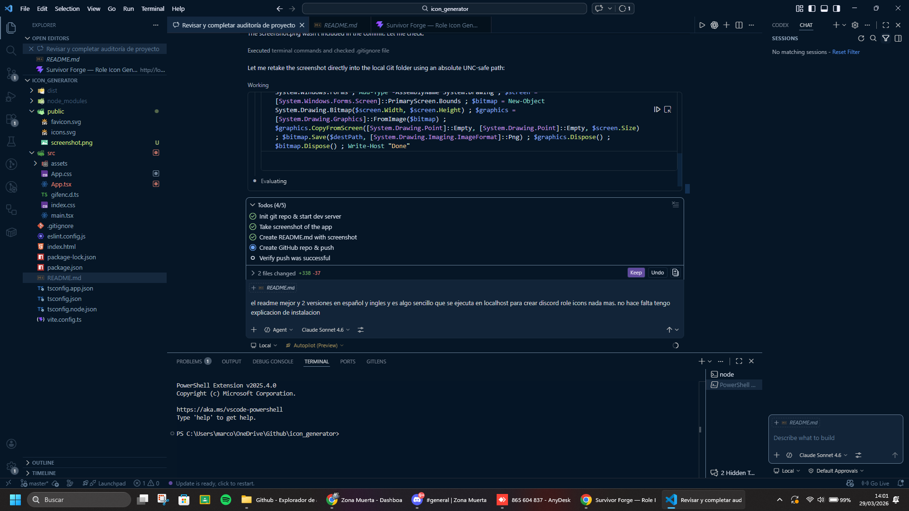

# 🎮 Survivor Forge — Discord Role Icon Generator

> A professional Discord Role Icon generator built for **FiveM RP servers**. Create stunning animated and static PNG icons with gradients, glow effects, presets, and live Discord preview — all in-browser.



---

## ✨ Features

- **14 one-click presets** — Admin, VIP Gold, Survivor, Zombie, Moderador, Prestige, Leyenda, Supremo, Policia, Medico, Narco, Militar, Booster, + more
- **Icon Library** — Browse thousands of icons (react-icons: Remix, Game, FontAwesome, Material) or search by name
- **6 icon categories** — Staff · Zombie · Prestigio · Policia · Militar · EMS · Criminal
- **Background types** — Transparent · Solid color · Gradient (angle control)
- **4 light effects** — Glow · Neon · Shadow · Contorno (stroke outline)
- **Transform controls** — Rotation slider (0–360°), Flip H / Flip V
- **7 GIF animations** — Pulse Glow · Neon Flare · Spin · Rainbow · Breathe · Shake · Shimmer
- **Animated GIF export** — Real GIF encoder (gifenc), 24 frames, works for Discord servers with Boost Level 3
- **PNG export** — 64 / 128 / 256 px all from a 256 px canvas
- **Copy to clipboard** — Instantly paste into Discord's upload dialog
- **Live Discord previews** — Chat message mock (cozy mode) + Member list side panel

---

## 🖥️ Tech Stack

| Technology | Purpose |
|---|---|
| React 19 + Vite 8 | App framework & bundler |
| TypeScript 5 | Type safety |
| framer-motion v12 | Live animation preview |
| react-icons | Icon libraries (Ri, Gi, Fa6, Md) |
| html-to-image | Canvas capture for PNG & GIF frames |
| gifenc | Pure-JS GIF encoder |
| lucide-react | UI icons |

---

## 🚀 Getting Started

```bash
# Install dependencies
npm install

# Start dev server
npm run dev

# Build for production
npm run build
```

Open `http://localhost:5173` in your browser.

---

## 📦 Export Formats

| Format | Sizes | Notes |
|---|---|---|
| PNG | 64 · 128 · 256 px | Transparent background supported |
| GIF | 64 · 128 · 256 px | Needs Discord Boost Lvl 3 · 24 frames · ~1.2s loop |

---

## 🎨 Icon Categories

| Category | Icons |
|---|---|
| Staff | Shields, crowns, badges |
| Zombie | Skulls, biohazard, zombie hands |
| Prestigio | Diamonds, trophies, gold |
| Policia | Police badge, handcuffs, car |
| Militar | Military tech, medals, weapons |
| EMS | Hospital cross, first aid, fire |
| Criminal | Skull, mask, dagger, chains |

---

## 📄 License

MIT — free to use, modify, and distribute.

---

> Designed for **Zona Muerta RP** FiveM server community.

## Expanding the ESLint configuration

If you are developing a production application, we recommend updating the configuration to enable type-aware lint rules:

```js
export default defineConfig([
  globalIgnores(['dist']),
  {
    files: ['**/*.{ts,tsx}'],
    extends: [
      // Other configs...

      // Remove tseslint.configs.recommended and replace with this
      tseslint.configs.recommendedTypeChecked,
      // Alternatively, use this for stricter rules
      tseslint.configs.strictTypeChecked,
      // Optionally, add this for stylistic rules
      tseslint.configs.stylisticTypeChecked,

      // Other configs...
    ],
    languageOptions: {
      parserOptions: {
        project: ['./tsconfig.node.json', './tsconfig.app.json'],
        tsconfigRootDir: import.meta.dirname,
      },
      // other options...
    },
  },
])
```

You can also install [eslint-plugin-react-x](https://github.com/Rel1cx/eslint-react/tree/main/packages/plugins/eslint-plugin-react-x) and [eslint-plugin-react-dom](https://github.com/Rel1cx/eslint-react/tree/main/packages/plugins/eslint-plugin-react-dom) for React-specific lint rules:

```js
// eslint.config.js
import reactX from 'eslint-plugin-react-x'
import reactDom from 'eslint-plugin-react-dom'

export default defineConfig([
  globalIgnores(['dist']),
  {
    files: ['**/*.{ts,tsx}'],
    extends: [
      // Other configs...
      // Enable lint rules for React
      reactX.configs['recommended-typescript'],
      // Enable lint rules for React DOM
      reactDom.configs.recommended,
    ],
    languageOptions: {
      parserOptions: {
        project: ['./tsconfig.node.json', './tsconfig.app.json'],
        tsconfigRootDir: import.meta.dirname,
      },
      // other options...
    },
  },
])
```
